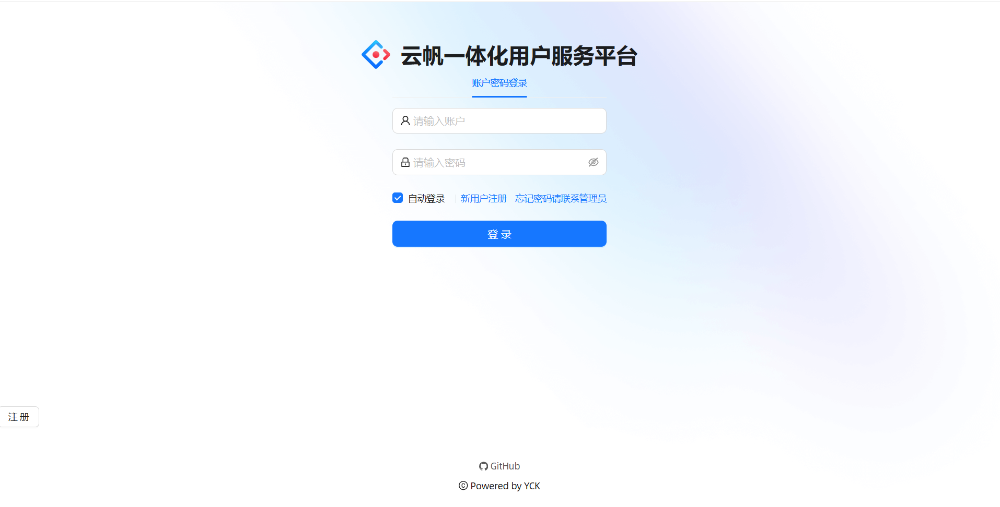
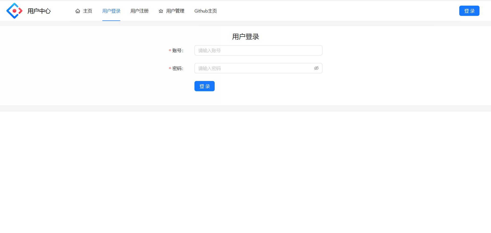
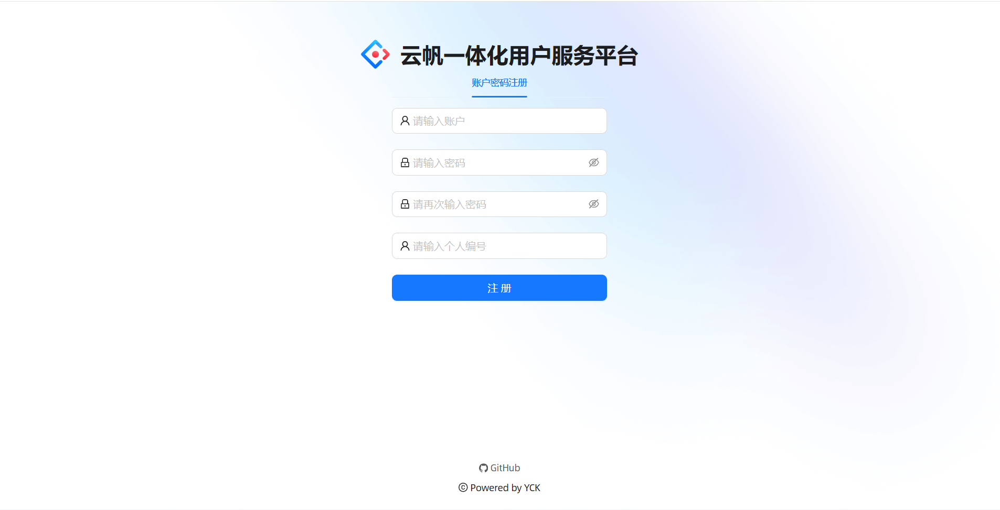
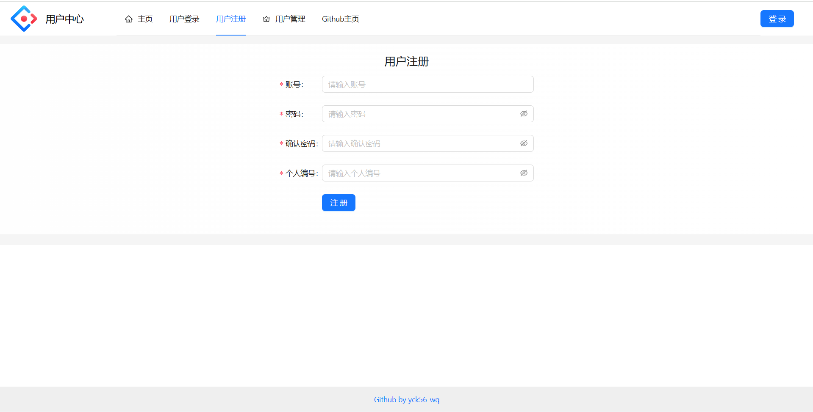
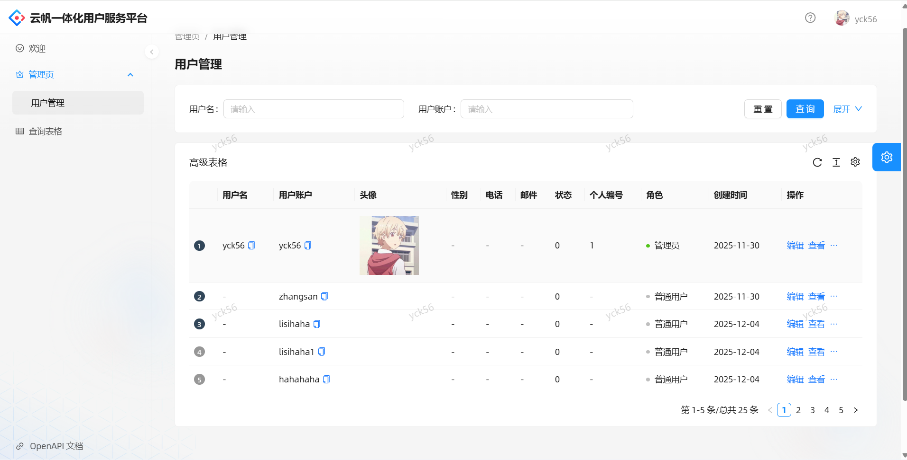
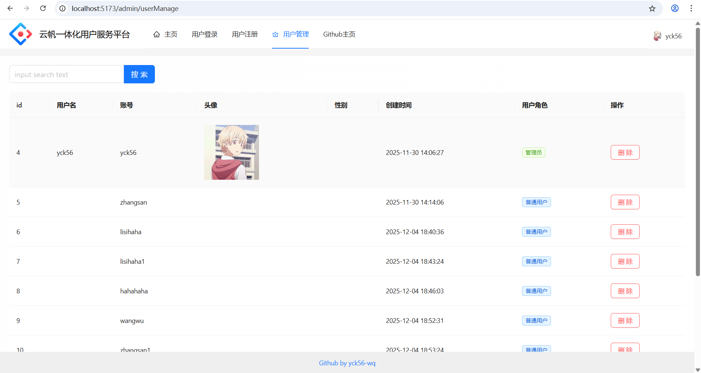

# 云帆一体化用户服务平台 (User Center)

一站式企业级用户管理系统，提供完整的用户生命周期管理能力，支持用户注册、登录、信息管理与权限控制。项目采用前后端分离，提供 Vue3 与 React 两套前端实现，兼顾不同技术栈的使用需求，设计上注重扩展性与可维护性。

---

## 目录
- [项目简介](#项目简介)
- [关键特性](#关键特性)
- [技术栈](#技术栈)
- [界面展示](#界面展示)
- [功能介绍](#功能介绍)
- [快速开始](#快速开始)
  - [前置准备](#前置准备)
  - [前端启动（React）](#前端启动react)
  - [前端启动（Vue）](#前端启动vue)
- [联系作者](#联系作者)

---

## 项目简介
云帆一体化用户服务平台面向企业中后台场景，提供用户注册、登录、注销、用户信息管理、分页展示、角色与权限控制等功能，适用于独立身份服务或作为微服务体系的一部分。

## 关键特性
- 用户注册、登录、退出与会话管理
- 用户列表分页、查询、查看、编辑与删除
- 基于角色的访问控制与操作权限校验
- 双前端实现：React + Ant Design Pro，Vue3 + Ant Design Vue
- 后端使用 Spring Boot + MyBatis/MyBatis-Plus

## 技术栈

前端（React）
- Node.js、npm
- Umi（v4.x）
- Ant Design Pro
- Axios、LocalStorage/Cookie

前端（Vue）
- Node.js、npm
- Vite
- Vue 3、Pinia、Vue Router
- Ant Design Vue、Axios

后端
- Java (JDK 1.8)
- Spring Boot (v2.6.13)
- MySQL 8
- MyBatis / MyBatis-Plus
- Lombok
- junit5

---

## 界面展示
平台提供 **React** 和 **Vue** 两套前端实现，核心功能与业务逻辑完全一致，以下按功能模块展示两套前端的界面效果（图片建议按 `images/[功能名]/react-xxx.png` 和 `images/[功能名]/vue-xxx.png` 目录分类存放）。

### 用户登录
#### React 版

#### Vue 版

- 支持账号密码格式合法性校验（账号非空、密码长度限制等）
- 实现用户身份验证，登录成功后生成并存储登录态
- 登录失败时返回清晰的错误提示信息

### 用户注册
#### React 版

#### Vue 版

- 完成账号唯一性校验，避免重复注册
- 密码加密存储，保障用户数据安全
- 表单验证确保注册信息完整性，注册成功后自动跳转登录页

### 用户管理页
#### React 版

#### Vue 版

- 提供用户信息的多条件查询、批量操作与单条数据管理
- 支持分页展示用户列表，适配大数据量场景
- 管理操作提供即时反馈，操作结果实时展示

## 功能介绍
### 权限控制功能
#### React 版
- 基于 Umi 路由守卫实现登录态拦截，未登录用户访问管理页时自动跳转至登录页
- 通过后端返回的用户角色信息，在页面渲染前完成权限校验，普通用户访问管理页会触发 Ant Design 消息组件的权限不足提示
- 利用 Ant Design Pro 的权限配置能力，实现按钮级别的操作权限细粒度控制，例如普通用户无法看到“删除用户”“编辑角色”等按钮

#### Vue 版
- 通过 Vue Router 导航守卫拦截未授权访问，未登录用户访问管理页时自动跳转至登录页
- 基于 Pinia 全局状态管理的用户角色信息，在页面挂载时完成权限校验，普通用户访问管理页会触发 Ant Design Vue Message 组件的权限不足提示
- 通过自定义指令实现按钮级权限控制，根据用户角色动态显示/隐藏操作按钮，保障系统操作安全

### 退出登录功能
#### React 版
- 点击顶部导航栏的退出按钮后，清除 LocalStorage 中的登录 Token 与后端 Session 关联信息
- 通过 Umi 路由直接跳转至登录页，同时触发全局状态重置，防止未授权访问
- 支持在任意页面触发退出操作，操作后即时清空当前页面的用户相关数据

#### Vue 版
- 点击顶部导航栏的退出按钮后，清除 Pinia 中的登录态与 LocalStorage 中的 Token 信息
- 通过 Vue Router 跳转至登录页，同时销毁当前用户的相关全局状态
- 支持在任意页面触发退出操作，操作流程简洁且即时生效

---

## 快速开始

### 前置准备
- JDK 1.8
- Maven（或 Gradle，根据后端工程设置）
- Node.js（建议 v14+）与 npm
- MySQL 8.x（创建用于项目的数据库，例如 `user_center`）

 在 MySQL 中创建数据库：
   - 创建数据库：CREATE DATABASE user_center CHARACTER SET utf8mb4 COLLATE utf8mb4_unicode_ci;
   - 复制后端代码user-center-backend中的sql目录下的user.sql文件执行到数据库

### 前端启动（React）
1. 进入 React 前端目录（user-center-frontend-react）
2. 安装依赖：npm install
3. 启动开发服务器：npm run start:dev
4. 构建生产包：npm run build

### 前端启动（Vue）
1. 进入 Vue 前端目录（user-center-frontend-vue）
2. 安装依赖：npm install
3. 启动开发服务器：npm run dev
4. 构建生产包：npm run build

---

## 联系作者
- 仓库：https://github.com/yck56-wq/user-center
- 如需更多帮助或有问题请在 Issue 中提交。
